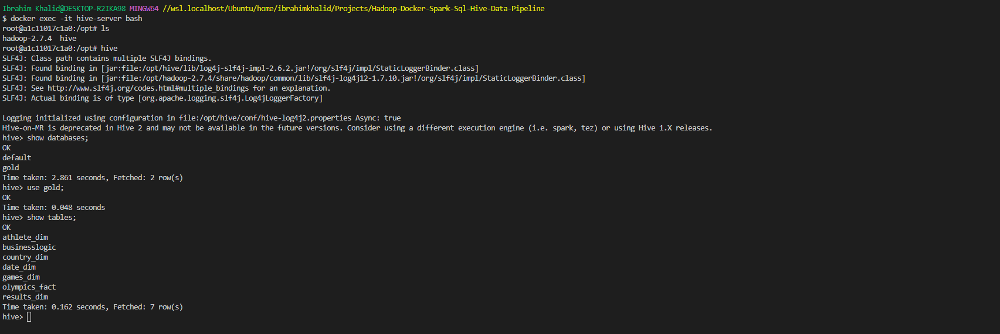
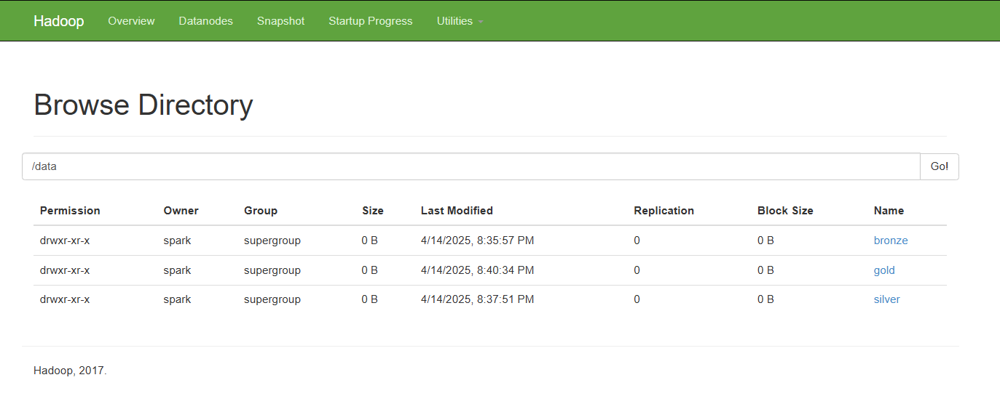
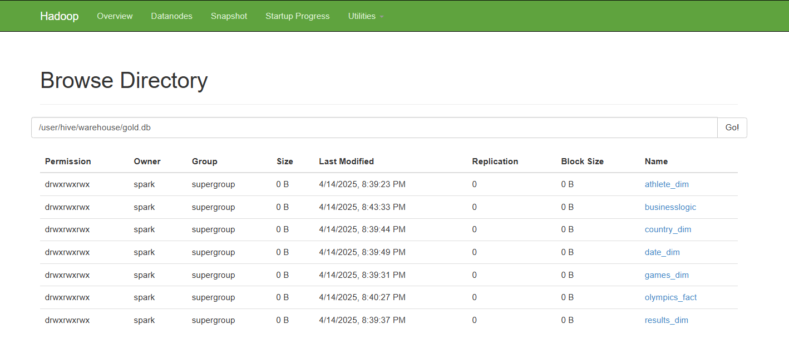

# Hadoop-Docker-Spark-Hive-DWH-Project
## Architecture Diagram


A Hadoop cluster built using Docker Compose, including Hadoop, Postgres (for Hive metastore), Jupyter Notebook, Hive, and Spark.


## Table of Contents

- [Introduction](#introduction)
- [Quick Start](#quick-start)
- [Interfaces](#interfaces)
- [DWH Schema](#DWH-Schema)
- [Hive and Hadoop Overview](#Hive-and-Hadoop-Overview)
- [Reporting](#Reporting)
- [Troubleshooting](#troubleshooting)

## Introduction

This repository uses [Docker Compose](https://docs.docker.com/compose/) to initialize a Hadoop cluster with the following components:

- **Hadoop**: Distributed file system (HDFS) with NameNode and DataNode.
- **Postgres**: Database backend for Hive metastore.
- **Jupyter Notebook**: Interactive Python environment with PySpark integration.
- **Hive**: Data warehouse solution for querying large datasets stored in HDFS.
- **Spark**: Distributed computing framework for big data processing, including Spark Master and Worker nodes.

This setup is ideal for development, testing, and learning purposes. It allows you to experiment with Hadoop, Hive, Spark, and Jupyter in an isolated environment without requiring complex installations.


## Quick Start

### Prerequisites
- Install [Docker](https://www.docker.com/) and [Docker Compose](https://docs.docker.com/compose/).

### Starting the Cluster

1. Clone this repository and navigate to the project directory:
   ```bash
   git clone https://github.com/your-repo/hadoop-docker-cluster.git
   cd hadoop-docker-cluster
   ```
 2. Run the startup script:
    ```bash
	./start_demo.sh
	```
3. To stop the cluster, run:
	```bash
	./stop_demo.sh
	```

## Interfaces

Once the cluster is up and running, you can access the following services via your browser:

- **NameNode UI**: [http://localhost:9870/dfshealth.html#tab-overview](http://localhost:9870/dfshealth.html#tab-overview)  
  *(Overview of HDFS and its health status)*

- **DataNode UI**: [http://localhost:50020/](http://localhost:50020/)  
  *(Status of the DataNode)*

- **Spark Master UI**: [http://localhost:8080/](http://localhost:8080/)  
  *(Monitor Spark jobs and worker nodes)*

- **HiveServer2**: [http://localhost:10000/](http://localhost:10000/)  
  *(Thrift server for Hive queries)*

- **Jupyter Notebook**: [http://localhost:8888/](http://localhost:8888/)  
  *(Interactive notebook environment with PySpark support)*

## DWH Schema
[Star Schema](./DataSchema)


## Hive and Hadoop Overview

### Hive CLI Interaction




The Hive CLI allows users to manage and query Hive databases and tables directly from the command line. Below are the steps to interact with the Hive CLI:

1. **Access the Hive Server Container**  
   Use the command `docker exec -it hive-server bash` to access the Hive server container.

2. **Enter the Hive CLI**  
   Execute the `hive` command to enter the Hive CLI.

3. **List Databases**  
   Run `show databases;` to list all available databases.

4. **Select a Database**  
   Use `use gold;` to select the `gold` database.

5. **View Tables**  
   Execute `show tables;` to display all tables within the selected database.

### Hadoop Web UI: Directory Browser


#### Root Directory (`/data`)


- The `/data` directory contains three subdirectories:
  - `bronze`
  - `silver`
  - `gold`

#### Hive Warehouse Directory (`/user/hive/warehouse/gold.db`)


- The `/user/hive/warehouse/gold.db` directory represents the Hive warehouse for the `gold` database.


## Reporting
### overview 


### country


## Troubleshooting

Here are some common issues and their solutions:

- **Ports Already in Use**:  
  If any ports (e.g., `9870`, `8080`, `8888`) are already in use, modify the `docker-compose.yml` file to use different host ports.

- **Configuration Issues**:  
  Ensure all environment variables and mounted volumes are correctly set in the `docker-compose.yml` file.

- **Logs**:  
  Check container logs for errors using the following command:
  ```bash
  docker logs <container_name>

## Contact Information
📧 Email: [engibrahimkhalid01@gmail.com](mailto:engibrahimkhalid01@gmail.com)  
🔗 LinkedIn: [Ibrahim Khalid](https://www.linkedin.com/in/ibrahim-khalid-b03261242/)  
🐦 Twitter: [@IbrahimKhalid_K](https://x.com/IbrahimKhalid_K)

For any queries, feel free to reach out!
